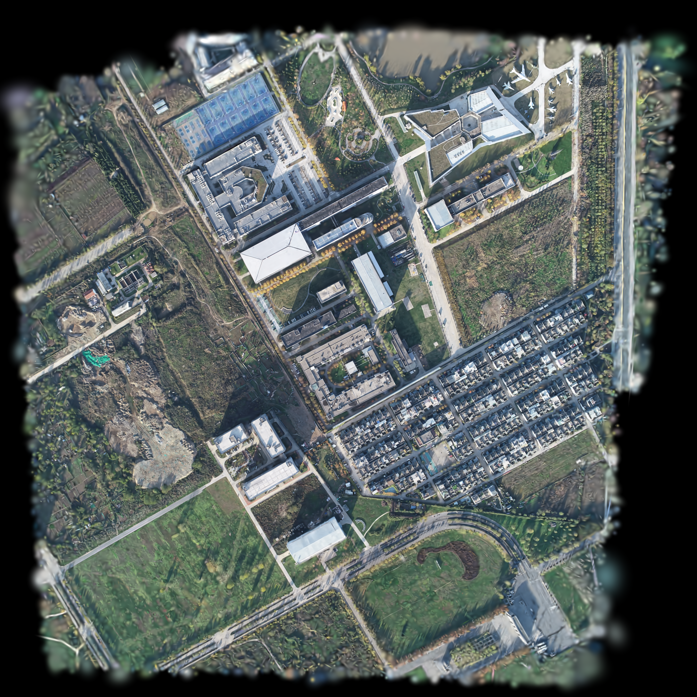
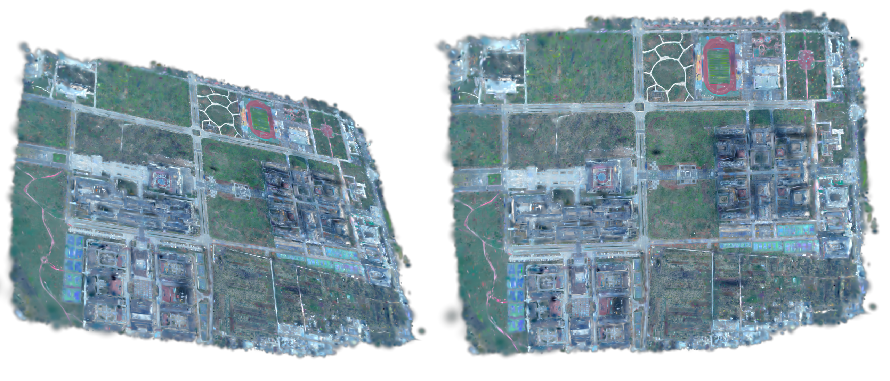
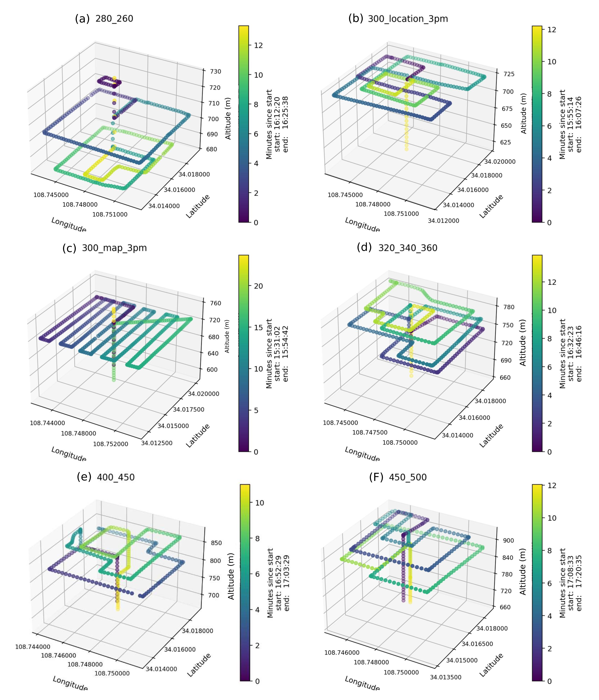
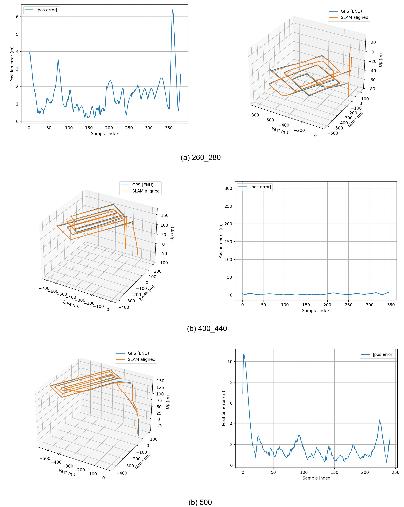
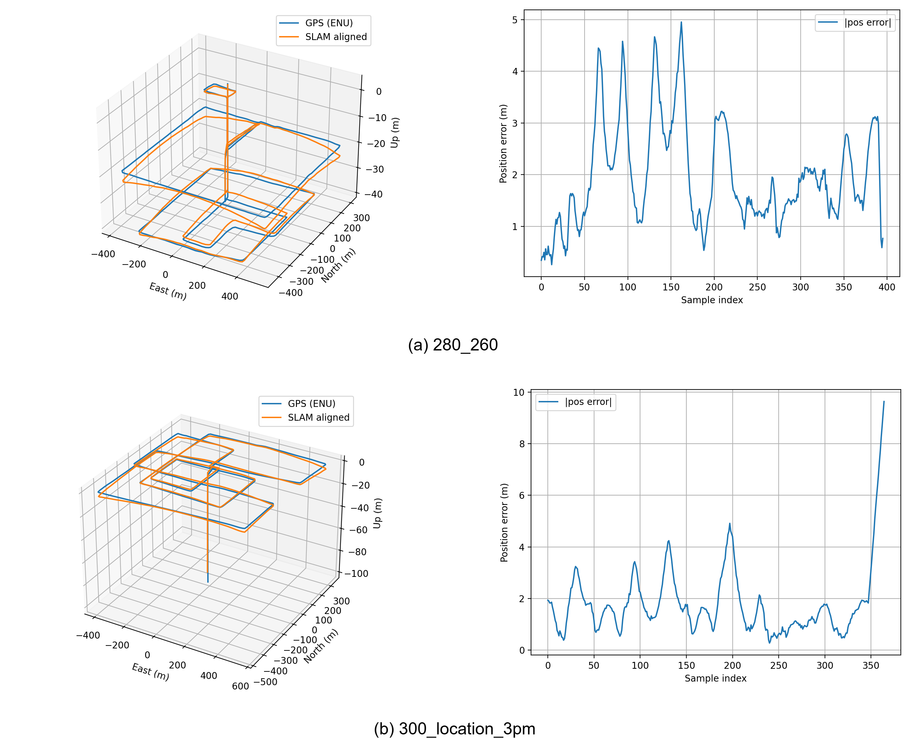
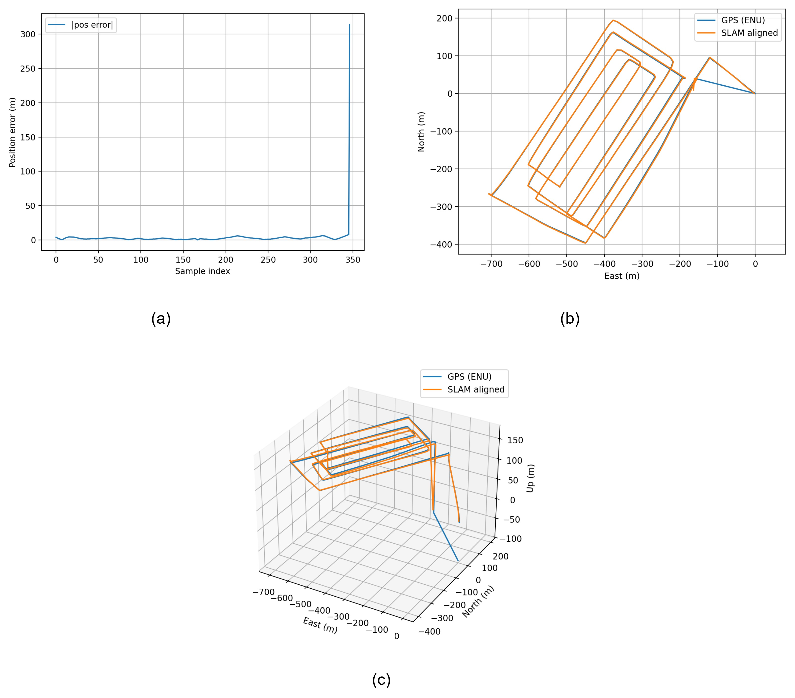
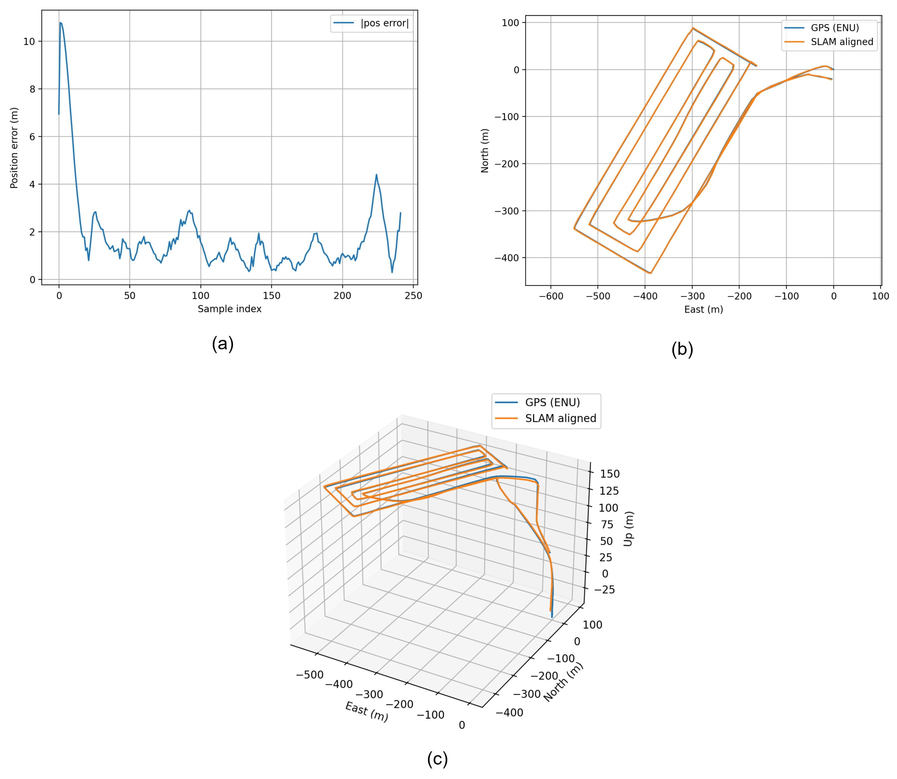

# FFS-SLAM Dataset and Project Page

## Overview

This repository supports the paper **"FFS-SLAM: Feed-Forward-Enhanced Submap Gaussian SLAM"**. FFS-SLAM is a monocular RGB-only 3D Gaussian Splatting SLAM system designed for large-scale UAV and outdoor mapping. The method combines render-free frame-to-frame tracking, feed-forward depth priors with depth-scale alignment, bounded-memory submap mapping, and FAISS-based duplicate pruning.

This page provides supplementary dataset descriptions, trajectory visualizations, qualitative mapping examples, and evaluation summaries for the paper. It is intended to help reviewers inspect the UAV datasets and understand how the repository supports the reported experiments.

## Paper

- **Title:** FFS-SLAM: Feed-Forward-Enhanced Submap Gaussian SLAM
- **Authors:** Besufekad T. Hadero, JiaHao Liu, Tao Yang, Negaar Rezvanfar, Ke Ma
- **Venue:** TBD
- **Paper:** [FFS_SLAM (11).pdf](FFS_SLAM%20%2811%29.pdf)
- **Project page / repository URL:** TBD

## How This Project Page Relates to the Paper

The paper references this repository for additional dataset details, sequence statistics, metadata format, trajectory visualizations, and qualitative results. In particular, the repository complements the paper by showing:

- GPS/EXIF-derived trajectory visualizations for representative UAV sequences.
- Per-frame position error curves after trajectory alignment.
- Dataset-level flight/altitude visualizations for NPUFly and Jianda.
- Qualitative Gaussian map renderings for outdoor UAV scenes.
- Runtime and peak GPU memory summaries for long NPUFly sequences.

## Dataset Summary

The paper evaluates FFS-SLAM on two outdoor multi-altitude monocular UAV datasets, **NPUFly** and **Jianda**. Some provided files use the spelling **Jiada**; this README uses **Jianda/Jiada** where needed to preserve the paper name and the file naming.

According to the paper, the UAV datasets are captured over semi-urban outdoor scenes containing buildings, roads, vegetation, open areas, repeated structures, and weak-texture regions. The datasets include constant-altitude and mixed-altitude flights. These conditions are challenging for monocular SLAM because they include altitude changes, weak parallax, long-range motion, and large outdoor scene scale.

The datasets are intended for **monocular UAV SLAM** and **dense Gaussian mapping** evaluation. The evaluation uses RGB-only input for FFS-SLAM; GPS/EXIF-derived trajectories are used as global references for ATE evaluation after Sim(3) alignment.

## Representative Dataset Visualizations

### NPUFly Reconstructed Map



This visualization shows representative reconstructed outdoor UAV maps from NPUFly. It is useful as a high-level qualitative view of the dense Gaussian mapping output over roads, buildings, vegetation, and open outdoor areas.

### Jianda/Jiada Reconstructed Map



This visualization shows representative reconstructed maps for the Jianda/Jiada dataset. It complements the NPUFly map by showing a different semi-urban outdoor scene with visible roads, building regions, vegetation, and open areas.

### NPUFly GPS/EXIF Flight Trajectories


### Jianda GPS/EXIF Flight Trajectories



This figure contains six 3D GPS/EXIF-derived flight visualizations with longitude, latitude, altitude, and elapsed time. The visible sequence labels are:

- `280_260`
- `300_location_3pm`
- `300_map_3pm`
- `320_340_360`
- `400_450`
- `450_500`

The figure is representative because it summarizes multiple Jianda altitude patterns in one place, including constant-altitude and mixed-altitude flights. Altitude axes and sequence names indicate multi-altitude UAV acquisition, but exact frame counts and sensor metadata files are not included in the current folder.

### NPUFly Trajectory and Position Error



This collage compares GPS/EXIF reference trajectories in an ENU frame with Sim(3)-aligned SLAM trajectories, together with per-frame position error curves. The visible sequence labels include `260_280`, `400_440`, and `500`. The figure supports the paper's trajectory evaluation discussion.

### Jianda Trajectory and Position Error



This collage provides the same type of trajectory/error visualization for Jianda/Jiada. The visible panels include `280_260` and `300_location_3pm`. It is representative for explaining how GPS/EXIF reference trajectories and aligned SLAM trajectories are compared.

## Dataset Details

### NPUFly Sequences

The following sequence names, frame counts, and purposes are visible in the paper tables and provided figures.

| Dataset | Sequence | Altitude / label visible in files | Frames | Scene type | GPS/EXIF availability | Purpose |
|---|---:|---|---:|---|---|---|
| NPUFly | `260_280` | `260_280` | 380 | Outdoor semi-urban UAV | GPS/EXIF-derived reference used for ATE; raw metadata TBD | Rendering, ATE, runtime/memory |
| NPUFly | `300_map` | `300_map` | 545 | Outdoor semi-urban UAV | GPS/EXIF-derived reference used for ATE; raw metadata TBD | Rendering, ATE, runtime/memory |
| NPUFly | `400_440` | `400_440` | 347 | Outdoor semi-urban UAV | GPS/EXIF-derived reference used for ATE; raw metadata TBD | Rendering, ATE, runtime/memory |
| NPUFly | `500` | `500` | 242 | Outdoor semi-urban UAV | GPS/EXIF-derived reference used for ATE; raw metadata TBD | Rendering, ATE, runtime/memory |

### Jianda/Jiada Sequences

The following sequence names are visible in the paper tables and dataset visualization files. Frame counts are not visible in the current folder.

| Dataset | Sequence | Altitude / label visible in files | Frames | Scene type | GPS/EXIF availability | Purpose |
|---|---:|---|---:|---|---|---|
| Jianda/Jiada | `280_260` | `280_260` | TBD | Outdoor semi-urban UAV | GPS/EXIF-derived reference used for ATE; raw metadata TBD | Rendering, ATE, trajectory visualization |
| Jianda/Jiada | `300_location_3pm` | `300_location_3pm` | TBD | Outdoor semi-urban UAV | GPS/EXIF-derived reference used for ATE; raw metadata TBD | Rendering, ATE, trajectory visualization |
| Jianda/Jiada | `300_location_5pm` | `300_location_5pm` | TBD | Outdoor semi-urban UAV | GPS/EXIF-derived reference used for ATE; raw metadata TBD | Rendering, ATE |
| Jianda/Jiada | `300_map_3pm` | `300_map_3pm` | TBD | Outdoor semi-urban UAV | GPS/EXIF-derived reference used for ATE; raw metadata TBD | Rendering, ATE, trajectory visualization |
| Jianda/Jiada | `320_340_360` | `320_340_360` | TBD | Outdoor semi-urban UAV | GPS/EXIF-derived reference used for ATE; raw metadata TBD | Dataset flight visualization |
| Jianda/Jiada | `400_450` | `400_450` | TBD | Outdoor semi-urban UAV | GPS/EXIF-derived reference used for ATE; raw metadata TBD | Dataset flight visualization |
| Jianda/Jiada | `450_500` | `450_500` | TBD | Outdoor semi-urban UAV | GPS/EXIF-derived reference used for ATE; raw metadata TBD | Rendering, ATE, dataset flight visualization |

## Trajectory and Evaluation Protocol

The paper reports trajectory accuracy using **ATE RMSE in meters**. GPS/EXIF-derived trajectories are used as global references for the UAV datasets. Estimated SLAM trajectories are aligned to the reference trajectory using **Sim(3)** before computing error. This is appropriate for monocular SLAM because the estimated trajectory may contain an arbitrary global scale before alignment.

Rendering quality is evaluated using:

- **PSNR**: higher is better.
- **SSIM**: higher is better.
- **LPIPS**: lower is better.

The paper also reports peak GPU memory and total wall-clock runtime on representative long NPUFly flights to evaluate scalability under the proposed submap streaming design.

### Reported ATE Summary

| Dataset | Metric | FFS-SLAM result visible in paper | Notes |
|---|---|---:|---|
| NPUFly | Average ATE RMSE | 2.045 m | Best average among compared methods in the paper table |
| Jianda | Average ATE RMSE | 2.651 m | Best average among compared methods in the paper table |

## Qualitative Results

### High-Altitude NPUFly Trajectory Examples



This figure shows NPUFly `400_440` trajectory/error panels. It is useful for inspecting a high-altitude or mixed-altitude sequence where the paper notes weak parallax and long-range UAV motion.



This figure shows NPUFly `500` trajectory/error panels. The paper discusses 500 m UAV evaluation as a challenging high-altitude case with limited parallax.

The paper's qualitative rendering comparison states that FFS-SLAM preserves more coherent road, building, and vegetation structures at 300 m and 500 m than the compared Gaussian SLAM baselines, while the baselines show stronger blur, local distortion, and boundary artifacts. The current folder contains the trajectory/error panels and map visualizations, but the exact multi-method qualitative comparison image from the paper is not present as a standalone file.

## Runtime and Memory

The paper reports runtime and peak GPU memory on NPUFly sequences. Runtime is wall-clock seconds and memory is peak GPU memory in GB.

| NPUFly sequence | Frames | Method | Runtime (s) | Peak GPU memory (GB) |
|---|---:|---|---:|---:|
| `260_280` | 380 | MonoGS | 1665 | 20.0 |
| `260_280` | 380 | Hi-SLAM2 | 255 | 17.5 |
| `260_280` | 380 | Ours w/o submap streaming | 246 | 18.0 |
| `260_280` | 380 | Ours | 342 | 12.0 |
| `300_map` | 545 | MonoGS | 2650 | 21.5 |
| `300_map` | 545 | Hi-SLAM2 | 270 | 18.5 |
| `300_map` | 545 | Ours w/o submap streaming | 261 | 18.5 |
| `300_map` | 545 | Ours | 390 | 12.0 |
| `400_440` | 347 | MonoGS | 1480 | 19.5 |
| `400_440` | 347 | Hi-SLAM2 | 150 | 14.5 |
| `400_440` | 347 | Ours w/o submap streaming | 143 | 14.7 |
| `400_440` | 347 | Ours | 197 | 12.0 |
| `500` | 242 | MonoGS | 989 | 17.0 |
| `500` | 242 | Hi-SLAM2 | 97 | 14.0 |
| `500` | 242 | Ours w/o submap streaming | 101 | 15.3 |
| `500` | 242 | Ours | 130 | 11.0 |

These results support the paper's claim that submap streaming reduces peak GPU memory to approximately 11-12 GB across the reported NPUFly sequences, with moderate runtime overhead relative to the no-streaming variant.

Code release: **TBD**.

Precomputed results and visualizations: **TBD**.

## Citation

If you use this project, please cite:

```bibtex
@article{hadero2026ffsslam,
  title   = {FFS-SLAM: Feed-Forward-Enhanced Submap Gaussian SLAM},
  author  = {Hadero, Besufekad T. and Liu, JiaHao and Yang, Tao and Rezvanfar, Negaar and Ma, Ke},
  journal = {TBD},
  year    = {2026},
  note    = {Manuscript under review}
}
```
